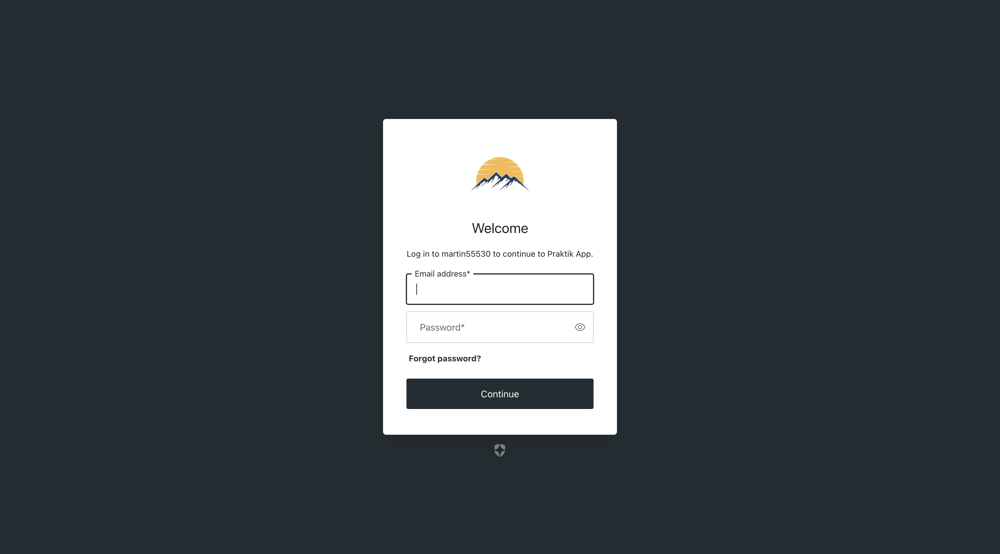
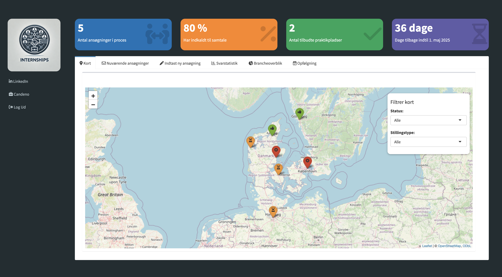
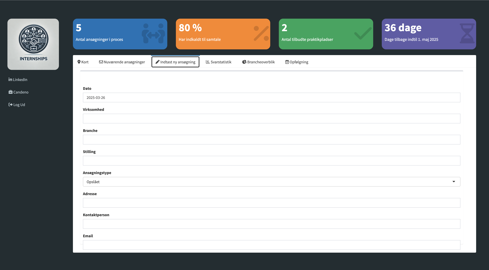
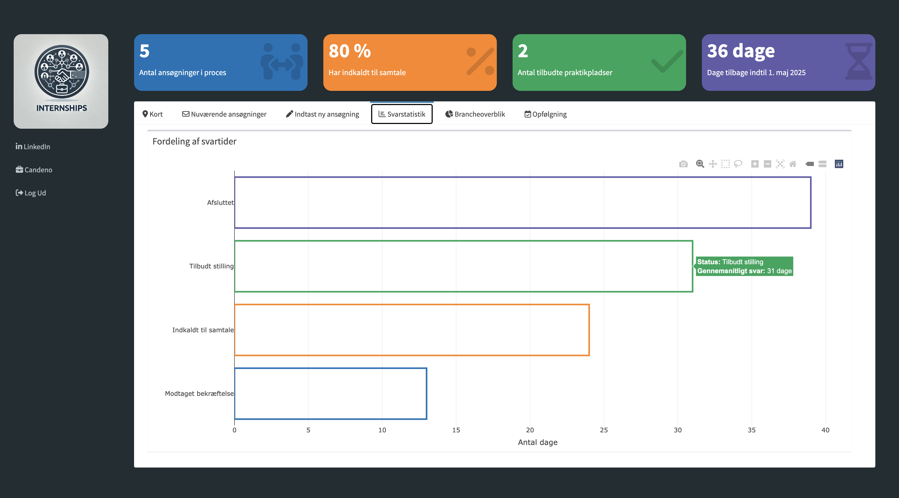
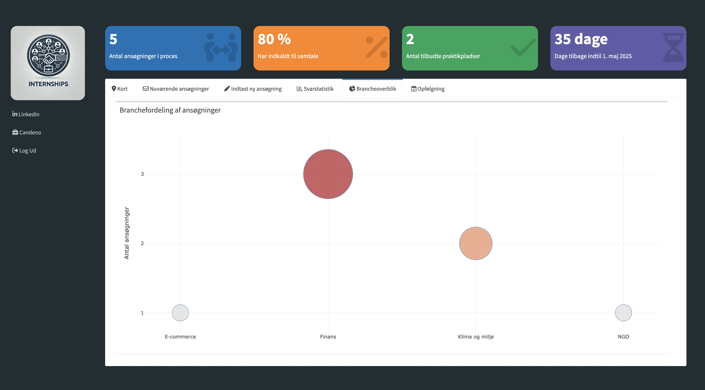
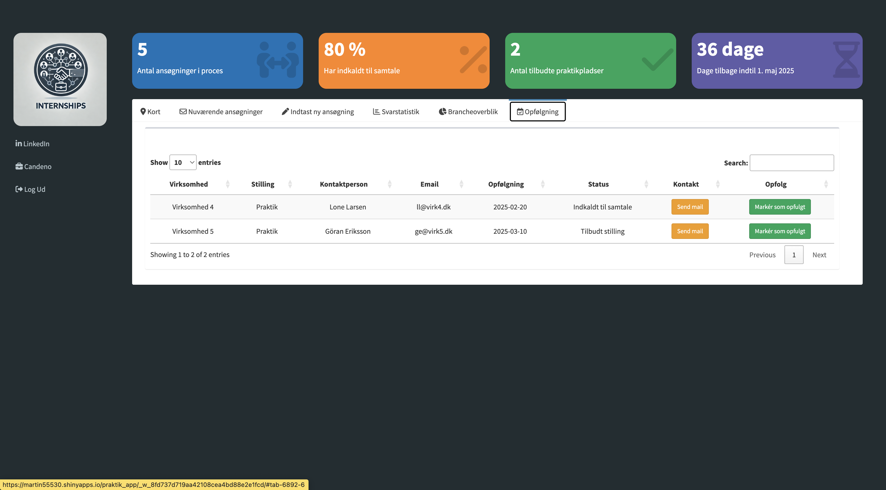

# PraktikApp – Opfølgningsværktøj til praktikansøgninger

Et personligt værktøj udviklet i R og Shiny til at holde styr på praktikansøgninger, mails og opfølgninger. Appen er bygget til at skabe overblik og sikre rettidig opfølgning – og har været et centralt værktøj i min egen praktikproces.

## 🧩 Funktioner
- Dynamisk dashboard med status og statistik
- Google Sheets-integration til lagring og opdatering
- Kalenderfunktion til planlagte opfølgninger
- Mulighed for at markere virksomheder og sende mails direkte
- Auth0-login for adgangskontrol

## 💻 Teknisk stack
- **R / Shiny**
- `googlesheets4` til datahåndtering
- `leaflet` og `shinydashboard` til visuel præsentation
- `shinyjs` til dynamisk brugergrænseflade
- `Auth0` til login

## 📸 Screenshots

| Login page | Kort | Ansøgninger | Indtast ny ansøgning | Svarstatistik | Brancheoverblik | Opfølgning |
|----------|------------|----------|
|  |  |  |  | |  |

> Flere billeder og evt. demo-video kommer snart...

## 🎯 Motivation

Jeg byggede PraktikApp som svar på et behov for at skabe struktur i en travl ansøgningsproces. Der fandtes ingen passende værktøjer, så jeg udviklede mit eget.

Det har både givet mig overblik og fungeret som en case til at træne Shiny, API-integration og autentificering.

## 🚫 Kildekode

Da appen er personlig og muligvis udvides, er kildekoden ikke offentliggjort. Men jeg fremviser den gerne ved interesse.

## 📩 Kontakt

Er du nysgerrig på appen eller teknikken bag?  
📧 Skriv til mig på [martinbindner@gmail.com]  
📞 Eller kontakt via LinkedIn [https://www.linkedin.com/in/martin-eckberg-bindner-26153b2b3/]

---
